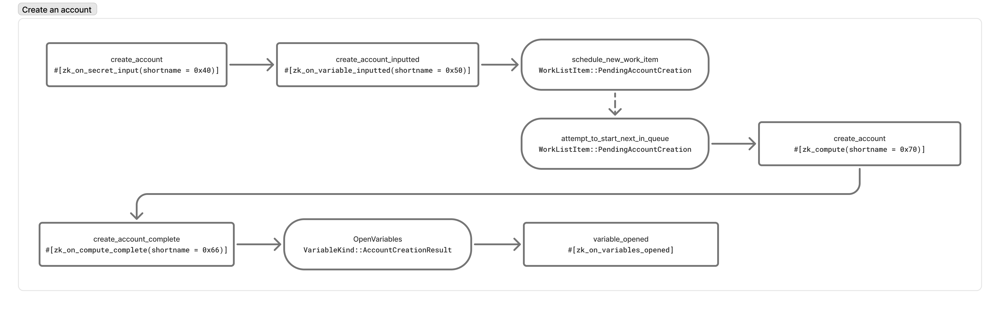
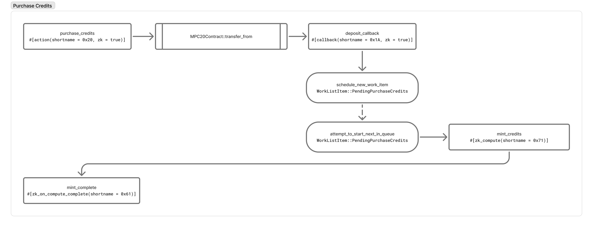
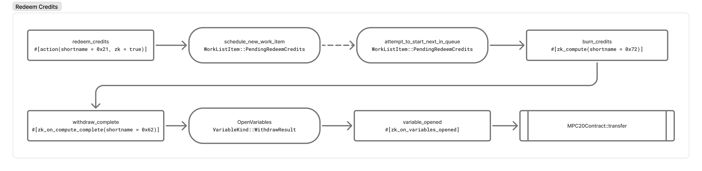
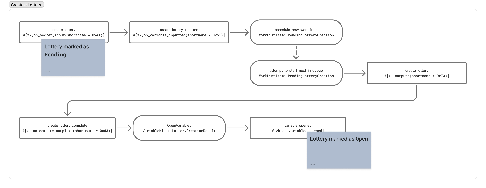
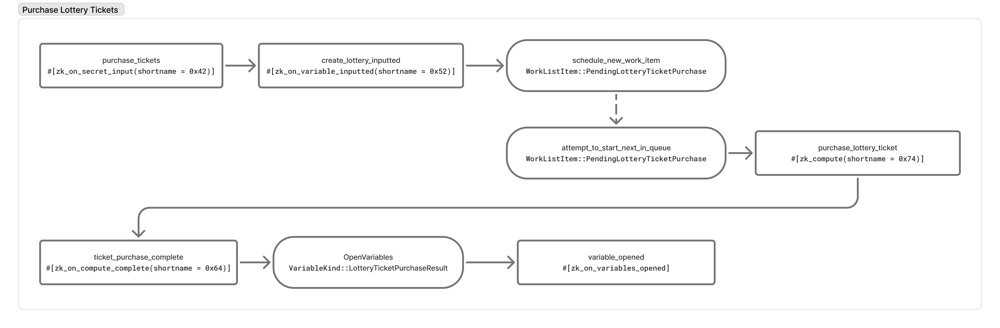
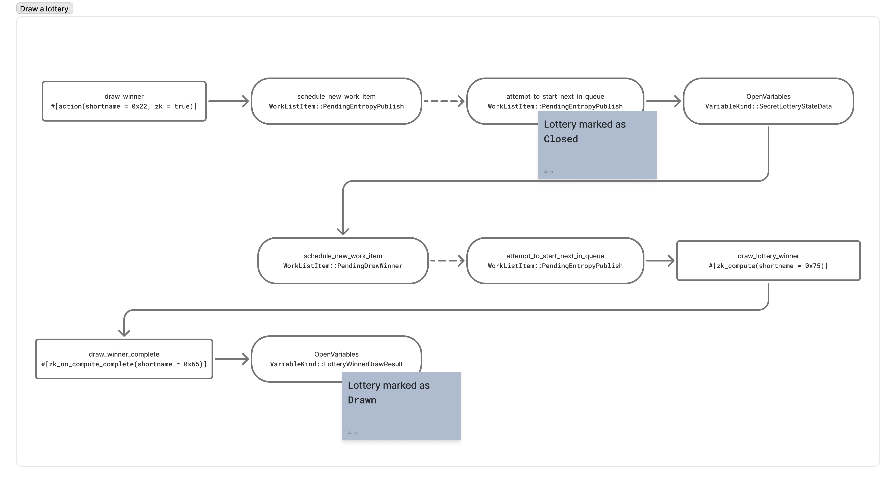
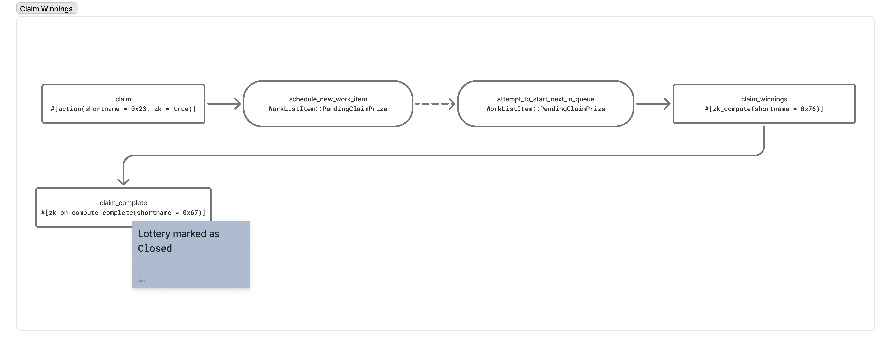

# Partisia Private Lottery System

A decentralized lottery platform built on the Partisia Blockchain, leveraging Multi-Party Computation (MPC) for enhanced privacy and fairness in lottery operations.

## Overview

This project demonstrates how MPC technology can be applied to create a fully private, transparent, and fair lottery system where:

- Participant identities remain hidden
- Entry counts and ticket purchases are kept private
- Winner selection is verifiably random and cannot be manipulated
- Users maintain complete privacy of their financial transactions

## Components

### 1. Smart Contract

The core of the system is a Rust-based smart contract designed for the Partisia Blockchain, featuring:

- **MPC-Based Privacy**: Uses advanced multi-party computation for privacy-preserving operations
- **Stateful Lottery Management**: Tracks lottery lifecycle from creation through winner selection
- **Token Integration**: Works with MPC20 tokens for payments and prize distribution
- **Zero-Knowledge Proofs**: Implements ZK proofs for validating transactions without revealing data

#### Development and Deployment

- To run smart contract tests:

```bash
./java-run-tests.sh
```

- To build the contract:

```bash
cd rust
cargo partisia-contract build --release
```

🗂 **Build Output:**  
Located in `target/wasm32-unknown-unknown/release/`

📤 **Deployment:**  
Use the [Partisia Testnet Explorer](https://browser.testnet.partisiablockchain.com/contracts/deploy)  
Upload the `lottery.abi` and `lottery.zkwa` files for deployment.

### 2. API Server

The backend API serves as the bridge between the frontend application and the blockchain:

- Handles user authentication and session management
- Processes lottery-related requests and communicates with the blockchain
- Manages user profiles and preferences

### 3. Frontend Application

The user interface provides an intuitive experience for interacting with the lottery system:

- Modern React-based interface with responsive design
- Real-time lottery updates and notifications
- Secure wallet integration for transactions
- Visualization of lottery statistics and history

### User Flows

The Partisia Lottery system is designed to provide a secure, private, and fair lottery experience using MPC (Multi-Party Computation) technology. Below are the key user flows that describe how participants interact with the system.

#### Create an Account



This flow represents the initial onboarding process:

- Users create a private account secured by MPC to maintain privacy
- During account creation, a secret key is generated and split securely across the MPC network
- This account links the user's public address with their private balance information
- No one (not even the contract owner) can see the user's balance or transaction details
- Account creation requires a one-time setup but ensures all future interactions preserve privacy

#### Purchase Credits



Users need credits to participate in lottery activities:

- Credits are purchased using MPC20 tokens (Partisia's equivalent of ERC20)
- Funds are transferred from user's wallet to the lottery contract
- The contract creates a private credit balance for the user
- All balance updates occur under MPC protection, keeping user activity confidential
- Credit purchases are recorded privately, visible only to the user

#### Redeem Credits



Users can withdraw their credits back to tokens when desired:

- The redemption process converts private credits back to public MPC20 tokens
- Users specify the amount they wish to redeem
- MPC protocol verifies sufficient balance without revealing the full balance
- After verification, tokens are released back to the user's wallet
- The private balance is updated accordingly

#### Create a Lottery



Any user can create their own lottery:

- Creator specifies parameters including entry cost and deadline
- Creator deposits initial funds to cover minimum prize pool
- A unique lottery ID is generated to track this specific lottery instance
- The lottery begins in "Pending" status until parameters are confirmed
- Once funded, status changes to "Open" and it becomes available for ticket purchases
- All lottery data is stored in the contract, with private elements secured by MPC

#### Purchase Lottery Tickets



Participants can enter any open lottery:

- Users select an open lottery and purchase tickets using their credits
- The ticket purchase is processed privately using MPC
- Neither other participants nor the lottery creator can see who has entered
- Entry records are stored as private variables in the contract
- The prize pool updates with each entry, while maintaining privacy of individual participants

#### Draw Lottery Winner



When a lottery closes, a winner is selected:

- The lottery automatically closes when the deadline is reached
- A secure random selection process runs within the MPC environment
- Winner selection combines entropy from multiple sources to ensure fairness
- The MPC protocol reveals only the winning entry, not the full participant list
- The lottery status updates to "Drawn" with the winner address recorded

#### Claim Winnings



The winner can claim their prize:

- Only the selected winner can initiate the claim process
- MPC protocol verifies the winner's identity without revealing other entries
- Upon successful verification, the prize pool is transferred to the winner
- The private credit balance of the winner is updated accordingly
- The lottery status changes to "Complete" after successful prize distribution
- All transactions maintain privacy through MPC technology

### Privacy and Security Features

Our lottery implementation leverages Partisia Blockchain's MPC capabilities to ensure:

1. **Complete Participant Privacy**: No one can see who has entered a lottery
2. **Fair Winner Selection**: Random selection that cannot be manipulated
3. **Secure Balance Management**: User credit balances remain private
4. **Tamper-Proof Operations**: All contract operations are secured by blockchain consensus
5. **Transaction Confidentiality**: Financial details remain private throughout the process

## Technical Architecture

### Smart Contract Structure

The lottery contract consists of several key components:

- **LotteryState**: Central data structure tracking lottery instances and their statuses
- **ZK Computation Engine**: Handles private computations for ticket purchases and winner selection
- **MPC20 Integration**: Interfaces with token contracts for financial operations
- **State Transitions**: Manages the lottery lifecycle through well-defined states (Pending → Open → Closed → Drawn → Complete)

### Privacy-Preserving Technologies

This implementation uses several advanced cryptographic techniques:

- **Multi-Party Computation (MPC)**: Allows computations on encrypted data without revealing the data itself
- **Zero-Knowledge Proofs**: Enables verification without exposing sensitive information
- **Secret State Management**: Maintains confidential contract state that even validators cannot see
- **Secure Random Number Generation**: Combines on-chain entropy with user inputs for unbiasable randomness

## Getting Started

### Prerequisites

- Node.js 16+ and Yarn
- Rust toolchain with wasm32-unknown-unknown target
- Partisia Contract SDK
- Docker and Docker Compose (for local development)

### Development Setup

1. **Clone the repository**

```bash
git clone https://github.com/yourusername/partisia-lottery.git
cd partisia-lottery
```

2. **Start the backend services**

```bash
docker-compose up -d
```

3. **Install frontend dependencies**

```bash
cd frontend
yarn install
```

4. **Run the frontend application**

```bash
yarn dev
```

5. **Generate TypeScript bindings from contract ABI**

```bash
./ts-abi-codegen.sh
```

Visit `http://localhost:5173` to access the application.

## Contributing

Contributions are welcome! Please feel free to submit a Pull Request.

## License

This project is licensed under the MIT License - see the LICENSE file for details.
